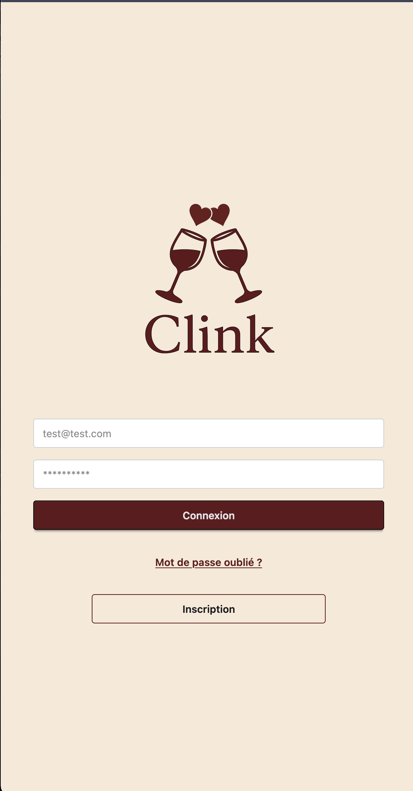
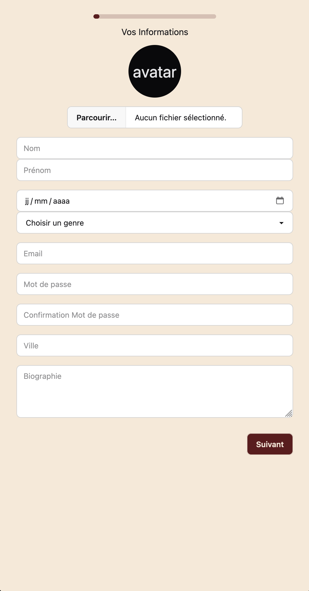

# 🧠 Documentation utilisateur – Clink

## Le site web

**[Liens vers le front client](https://clink-app.duckdns.org)**

**[Liens vers le front admin](https://clink-admin.duckdns.org)**

Attention BUGS possibles sur la version en ligne

## Parcours inscription de l'utilisateur

**Etape 1 :** Lancez l'inscription

Cliquez sur le bouton inscription

**Etape 2 :** Suivre les étapes de l'inscription

Suivre toutes les étapes de l'inscription

**Etape 3 :** Utilisez l'appli

1 `->` Sur l'acceuil vous retrouverez les utilisateurs compatibles avec vous

2 `->` Sur la messagerie, toutes vos conversations

3 `->` Les fonctionalités premium (voir les gens qui nous on likent et unlikent)

4 `->` Les paramètres de votre compte